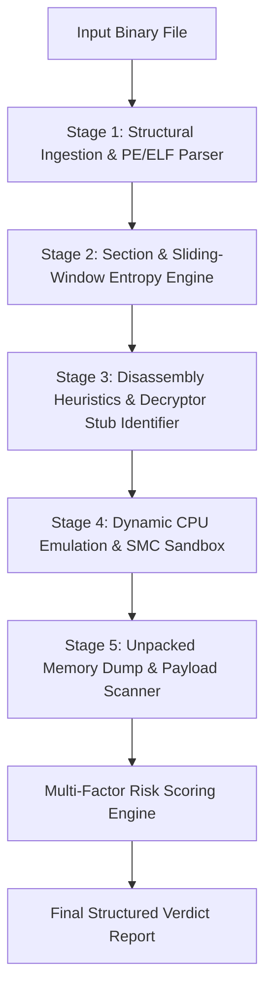

# Project Specification & Master Plan: Polymorphic Virus Detector
**Event**: Hackathon Technical Blueprint  
**Domain**: Cybersecurity / Malware Analysis / Reverse Engineering / Systems Programming  
**Document Type**: End-to-End Architectural Specification & Implementation Roadmap  

---

## 1. Project Overview & Motivation (The "Why")

### 1.1 The Core Problem: The Failure of Signature-Based Antivirus
For over three decades, traditional antivirus solutions relied almost entirely on **static signatures**:
- A security lab captures a malicious file.
- A cryptographic hash (MD5, SHA-1, SHA-256) or a distinctive sequence of bytes is extracted and added to a central database.
- Endpoint antivirus software scans incoming files against this database.

**Why this paradigm is obsolete:**
Modern malware authors rarely distribute raw, unencrypted binaries. Instead, they use automated **polymorphic engines** (mutation and packing frameworks) to generate thousands of unique variants of the same core malware every day. 
- In polymorphic malware, every infected host or generated file has a **different cryptographic hash**.
- A static signature database with 500 million file hashes has a **0% detection rate** against a brand new polymorphic variant of a known virus.

### 1.2 What This Project Delivers
This project implements a **Multi-Tier Polymorphic Malware Detection Engine** designed to detect polymorphic binaries **without needing prior knowledge of their specific hash or encryption key**.

Instead of matching static byte sequences, our engine analyzes the **fundamental mathematical and structural invariants** that every polymorphic virus must exhibit:
1. **High Shannon Entropy**: The mathematical signature of encrypted ciphertext.
2. **$W \oplus X$ (Write-and-Execute) Memory Violations**: The architectural requirement for a program to modify its own code space.
3. **Entry-Point Decryptor Loop Heuristics**: Distinct assembly patterns used to iteratively unscramble code in memory.
4. **Sandboxed CPU Emulation (Dynamic Unpacking)**: Executing the binary in an isolated virtual processor to catch the virus in the act of decrypting itself.

---

## 2. Theoretical Foundations: Anatomy of Polymorphism

### 2.1 The Malware Mutation Spectrum

| Category | How It Works | Antivirus Evasion Capability | Detection Difficulty |
| :--- | :--- | :--- | :--- |
| **Static / Plain** | Exact same executable code and bytes every infection. | Zero. Blocked instantly by file hash (SHA-256). | Trivial ($O(1)$ lookup) |
| **Oligomorphic** | Encrypted payload, but chooses between a small fixed set (e.g., 5 to 20) of predefined decryptor stubs. | Low. AV vendors write 20 static signatures covering all stub variants. | Low |
| **Polymorphic** *(Our Target)* | Encrypted payload with random keys + an **infinite number of mutated decryptor stubs** generated via code mutation techniques. | **High**. Hashes and static byte signatures completely fail. | **High** (Requires heuristics & emulation) |
| **Metamorphic** | Rewrites the entire binary using compiler-level transformations (re-ordering functions, swapping registers, dead code) without needing encryption. | Extremely High. No static payload exists. | Very High (Requires deep graph matching) |

---

### 2.2 Inside a Polymorphic Binary: The Two Halves

Every polymorphic executable is physically split into two components:

```
+-------------------------------------------------------------------------+
|                       POLYMORPHIC BINARY LAYOUT                         |
|                                                                         |
|  +-------------------------------------------------------------------+  |
|  | 1. MUTATING DECRYPTOR STUB (Executes First)                       |  |
|  |    - Contains the loop that restores the original virus.          |  |
|  |    - Mutates on every build using mutation engine techniques:     |  |
|  |        * Register Swapping (eax <-> ebx <-> ecx)                  |  |
|  |        * Junk/Dead Code Insertion (NOPs, dummy math)              |  |
|  |        * Equivalent Instruction Substitution                      |  |
|  |        * Variable keys (e.g., 0x5A today, 0xBF tomorrow)          |  |
|  +-------------------------------------------------------------------+  |
|                                |                                        |
|                                v (Decryption Loop in Memory)            |
|  +-------------------------------------------------------------------+  |
|  | 2. ENCRYPTED PAYLOAD (High Entropy Ciphertext)                    |  |
|  |    - The actual malware body (dropper, infostealer, ransomware).  |  |
|  |    - Inaccessible to static scanners until decrypted.             |  |
|  |    - Statistically indistinguishable from random noise.           |  |
|  +-------------------------------------------------------------------+  |
+-------------------------------------------------------------------------+
```

---

### 2.3 How Mutation Engines Obfuscate the Decryptor Stub

To defeat simple opcode matching, polymorphic engines employ four main code transformation techniques:

1. **Instruction Substitution (Equivalence Matching)**:
   - To zero out a register:
     - Variant A: `xor eax, eax` (`0x31 0xC0`)
     - Variant B: `sub eax, eax` (`0x29 0xC0`)
     - Variant C: `mov eax, 0` (`0xB8 0x00 0x00 0x00 0x00`)
   - To increment a counter:
     - Variant A: `inc ecx` (`0x41`)
     - Variant B: `add ecx, 1` (`0x83 0xC1 0x01`)
     - Variant C: `sub ecx, -1` (`0x83 0xE9 0xFF`)

2. **Register Swapping / Shuffling**:
   - Infection 1 uses `ECX` as the loop counter, `ESI` as the data pointer, and `AL` as the key.
   - Infection 2 uses `EDX` as the loop counter, `EDI` as the data pointer, and `BL` as the key.

3. **Junk / Dead-Code Insertion**:
   - Harmless, non-functional instructions are sprinkled between decryptor instructions:
     ```assembly
     mov ecx, 500        ; functional
     nop                 ; junk
     push eax            ; junk
     pop eax             ; junk (cancels out)
     lea esi, [data]     ; functional
     xor eax, eax        ; junk (doesn't affect decryptor)
     decrypt_loop:
     xor byte [esi], 0x4B; functional
     inc esi             ; functional
     loop decrypt_loop   ; functional
     ```

4. **Key and Algorithm Rotation**:
   - The cipher can be single-byte XOR, multi-byte XOR, sliding-key XOR, ADD/SUB chains, ROL/ROR bit-shifts, or lightweight block ciphers like TEA (Tiny Encryption Algorithm) or RC4.

---

## 3. Mathematical & Detection Principles

### 3.1 Shannon Entropy Analysis
Information entropy quantifies the degree of randomness or uncertainty in a data stream.

#### The Formula:
$$H(X) = -\sum_{i=0}^{255} P(x_i) \log_2 P(x_i)$$

Where:
- $X$ is the byte sequence being evaluated.
- $P(x_i)$ is the empirical probability of byte value $x_i$ occurring in the sequence ($\text{Count}(x_i) / N$).
- Entropy is measured in **bits per byte** on a scale from $0.0$ to $8.0$.

#### Benchmark Thresholds:
- **$0.0 - 2.0$**: Homogeneous data (large runs of null bytes `0x00` or padding).
- **$3.5 - 5.0$**: Human-readable ASCII text, strings, metadata.
- **$5.5 - 6.6$**: Standard compiled executable machine code (x86/x64 opcodes have structured distributions).
- **$7.2 - 8.0$**: **Encrypted or densely compressed data**. In an executable binary, any section measuring $> 7.2$ bits/byte indicates encrypted payload or packed executable code.

---

### 3.2 Operating System Memory Violations ($W \oplus X$)
Modern processors (x86/ARM) and operating systems implement **Data Execution Prevention (DEP)** and **Write XOR Execute ($W \oplus X$)**:
- A memory page can be **Writable** (to store data, heap, stack).
- A memory page can be **Executable** (to run instructions from `.text`).
- Legitimate software almost **never** marks a section as simultaneously Writable and Executable.

#### The Polymorphic Dilemma:
A self-decrypting binary must write decoded bytes into a memory buffer and then immediately jump execution to those newly written bytes. In the Portable Executable (PE) header, this manifests in the section characteristics:
```c
IMAGE_SCN_MEM_EXECUTE  = 0x20000000;
IMAGE_SCN_MEM_WRITE    = 0x80000000;

if ((section.Characteristics & IMAGE_SCN_MEM_EXECUTE) &&
    (section.Characteristics & IMAGE_SCN_MEM_WRITE)) {
    // VIOLATION: Self-modifying code capability detected
}
```

---

### 3.3 Opcode Heuristics & Control Flow Signatures
Regardless of register swapping or junk code insertion, a decryptor loop must fundamentally perform two actions:
1. **Mathematical Modification**: In-place arithmetic or bitwise operations (`XOR`, `ADD`, `SUB`, `ROR`, `ROL`) applied to indexed memory pointers.
2. **Backward Branching**: A conditional jump instruction whose target address is lower than the current instruction pointer (`target_address < current_address`), creating an iterative loop.

By stripping out neutral single-byte instructions (NOPs, balanced push/pops) and inspecting backward jumps, we can reliably flag decryptor loops without needing to know the exact registers used.

---

## 4. End-to-End System Architecture

The detector uses a five-stage pipeline designed to balance speed and accuracy:



### Stage 1: Structural Ingestion & Binary Parsing
- **Format Support**: Windows Portable Executable (PE32/PE32+) and raw shellcode/binary blobs.
- **Parsing Actions**:
  - Validates `MZ` DOS header and parses `e_lfanew` pointer to PE Header `0x50 0x45 0x00 0x00`.
  - Reads `COFF File Header` for architecture (`x86` vs `x64`) and section counts.
  - Extracts `AddressOfEntryPoint` (RVA where execution begins).
  - Traverses the `Section Table`: maps Virtual Addresses, Raw Sizes, File Offsets, and Memory Permissions.
  - Inspects the Import Address Table (IAT): flags unusually sparse import tables (e.g., fewer than 4 imported APIs, often just `LoadLibraryA` + `GetProcAddress`).

### Stage 2: Section & Sliding-Window Entropy Engine
- Computes overall file entropy.
- Computes per-section entropy for each PE section (`.text`, `.data`, `.rdata`, `.rsrc`, custom packed sections).
- **Sliding Window Analysis**: Uses a 256-byte sliding window across the entire file to identify local pockets of high entropy even if the overall file entropy is diluted by large null padding.

### Stage 3: Disassembly Heuristics & Decryptor Stub Identifier
- Disassembles up to 250 instructions starting from the file's Entry Point.
- Normalizes opcodes by filtering out junk code:
  - Eliminates single-byte NOPs (`0x90`), self-canceling register swaps, and redundant register operations.
- Traces branch instructions:
  - Detects backward jumps (`JMP 0xEB`, `JNZ 0x75`, `JZ 0x74`, `LOOP 0xE2`).
  - Measures loop span: loops spanning 10 to 120 bytes are typical for decryptor stubs.
  - Verifies presence of bitwise/arithmetic operations inside the loop boundaries.

### Stage 4: Dynamic CPU Emulation & Self-Modifying Code (SMC) Monitor
- **Virtual CPU Setup (Unicorn Engine)**:
  - Creates a simulated 32-bit x86 virtual processor.
  - Maps binary sections into their exact virtual addresses in simulated RAM.
  - Configures an isolated virtual stack (`ESP = 0x00100000`).
- **Hooking Strategy**:
  - `UC_HOOK_MEM_WRITE`: Intercepts every write operation to RAM. Logs the modified memory addresses into a set $W$.
  - `UC_HOOK_CODE`: Intercepts every instruction before it executes. Checks if the instruction pointer $EIP \in W$.
  - **The Trigger**: If execution enters an address that was previously written by code, a **Self-Modifying Code (SMC) event** is confirmed. The virus has finished decrypting its body and jumped into the payload.
- **Safety Bounds**: Caps total execution to 150,000 instructions to prevent denial-of-service from infinite loops.

### Stage 5: In-Memory Payload Extraction & YARA Scanning
- At the moment of the SMC transition, the emulator halts execution.
- The newly decrypted memory page is extracted directly from the emulator's RAM buffer.
- The raw decrypted buffer is scanned against standard YARA rules, string indicators (e.g., URLs, registry keys, API strings like `VirtualAlloc`, `WriteProcessMemory`), or traditional hash signatures that were previously obscured by the polymorphic layer.

---

## 5. Multi-Factor Risk Scoring Matrix

The engine combines all signals into a transparent, explainable 0–100 risk score:

| Signal / Indicator | Weight | Justification |
| :--- | :--- | :--- |
| **High Section Entropy ($> 7.2$)** | **+30 pts** | High mathematical likelihood of encrypted or packed payload. |
| **$W \oplus X$ Permission Violation** | **+25 pts** | Direct violation of modern security standards; indicates code modification intent. |
| **Entry Point Decryptor Loop Heuristic** | **+25 pts** | Structural evidence of looping math/XOR operations at the execution entry point. |
| **SMC Execution Jump ($W \to X$ in Emulation)** | **+35 pts** | Concrete runtime proof that code modified memory and executed the result. |
| **Extremely Sparse Import Table (< 4 APIs)** | **+10 pts** | Common characteristic of packed/polymorphic stubs that dynamically resolve APIs. |
| **Known Malicious Pattern / YARA Match** | **+50 pts** | Exact signature match on the unpacked payload in memory. |

### Classification Tiers:
- **`0 - 25` Score $\to$ [CLEAN]**: Normal binary layout, standard section entropy, no decryptor patterns.
- **`26 - 55` Score $\to$ [SUSPICIOUS / PACKED]**: High entropy or packed sections, but lacks explicit malicious decryptor stubs (e.g., standard UPX compression).
- **`56 - 100` Score $\to$ [HIGH RISK / CONFIRMED POLYMORPHIC]**: Convergence of high entropy, decryptor loop, and $W \oplus X$ execution characteristics.

---

## 6. Hackathon Sprint & Implementation Roadmap

```
+--------------------------------------------------------------------------+
| HACKATHON TIMELINE (24-HOUR SPRINT)                                      |
|                                                                          |
| [Hours 00 - 04] Foundation & Test Engine                                 |
|                 - Build benign synthetic test generator                  |
|                 - Build harmless polymorphic XOR loop generator          |
|                                                                          |
| [Hours 04 - 08] Static Engine & Entropy Profiler                         |
|                 - Implement zero-dependency PE header parser             |
|                 - Implement Shannon entropy & section flag inspector     |
|                                                                          |
| [Hours 08 - 14] Disassembly & Heuristic Engine                           |
|                 - Entry-point disassembler & opcode analyzer             |
|                 - Backward loop detector & junk code normalizer          |
|                                                                          |
| [Hours 14 - 18] Dynamic Unicorn Emulation                                |
|                 - Virtual CPU memory mapper                              |
|                 - Hook memory writes & code execution (SMC detection)    |
|                                                                          |
| [Hours 18 - 21] Scoring Engine & CLI Dashboard                           |
|                 - Multi-factor risk calculation                          |
|                 - Clean terminal interface with colorized reports        |
|                                                                          |
| [Hours 21 - 24] Testing, Benchmarking & Presentation Prep                |
|                 - Test on real Windows binaries (cmd.exe, notepad.exe)   |
|                 - Rehearse 2-minute elevator pitch and live demo         |
+--------------------------------------------------------------------------+
```

---

## 7. False Positive Mitigation & Edge Cases

When pitching to hackathon judges, handling edge cases demonstrates professional engineering maturity:

### 1. How do we differentiate benign packers (UPX) from malware?
- **Reality**: Benign software packers (like UPX or MPRESS) compress binaries to save bandwidth, which also creates high entropy.
- **Our Solution**: UPX creates distinct section names (`UPX0`, `UPX1`) and predictable decompression routines without randomized mutation. Benign compression scores in the **Suspicious** tier (`30-50`), whereas malicious polymorphic malware triggers additional flags (randomized register XOR loops, abnormal section names, SMC transitions into non-standard buffers), pushing it into the **High Risk** tier (`70+`).

### 2. What about encrypted assets in normal software?
- Modern video games and enterprise apps contain encrypted 3D models, textures, or media in `.rsrc` or `.data`.
- **Our Solution**: We evaluate **where** the entropy resides. Encrypted assets reside in non-executable data sections. In polymorphic malware, the high entropy is coupled with the **execution entry point** and executable section permissions.

### 3. What if malware authors use long sleep timers to stall the emulator?
- Traditional dynamic sandboxes fail because they wait for timeouts (e.g., 3 minutes).
- **Our Solution**: Our static analysis layers (Entropy + Opcode Disassembly) catch the polymorphic traits **instantly in milliseconds**, without needing to wait for a sleep timer to expire.

---

## 8. Hackathon Presentation & Judge Defense Script

### The 90-Second Winning Pitch
> *"Judges, over 80% of modern ransomware and malware droppers use polymorphic engines. Traditional antivirus software looks for static file hashes—like looking for a criminal's photo. But a polymorphic virus encrypts itself with a brand new key every single infection, generating a completely new hash every time. Traditional antivirus fails completely against zero-day variants.*
>
> *Our project is a **Multi-Tier Polymorphic Malware Detection Engine**. Instead of relying on static hashes, we detect the mathematical and architectural laws of polymorphism:*
> *First, we use **Shannon Entropy** to identify the cryptographic noise of the encrypted payload.*
> *Second, we check for **$W \oplus X$ security violations** where code is granted permission to rewrite itself.*
> *Third, we disassemble the entry point to catch the **mutating decryptor loop** in assembly.*
> *Finally, we run a lightweight **virtual CPU emulator** that lets the virus safely unpack itself in an isolated memory space, extracting the original payload for scanning.*
>
> *Here is our tool running live against both clean binaries and mutated polymorphic samples..."*

---

## 9. Technology Stack

- **Primary Language**: Python 3.10+ (Selected for rapid prototype speed, cross-platform testing, and native C-binding support).
- **Core Binary Parser**: Custom pure Python PE parser (zero external dependencies for high portability) + `pefile`.
- **Disassembly Engine**: `capstone` (Industry-standard x86/x64 instruction decoding).
- **CPU Virtualization / Emulation**: `unicorn-engine` (QEMU-derived CPU emulator for self-modifying code execution).
- **Rule & Signature Matching**: `yara-python`.
- **Data Visualization**: Rich CLI formatting / Markdown report generator.
