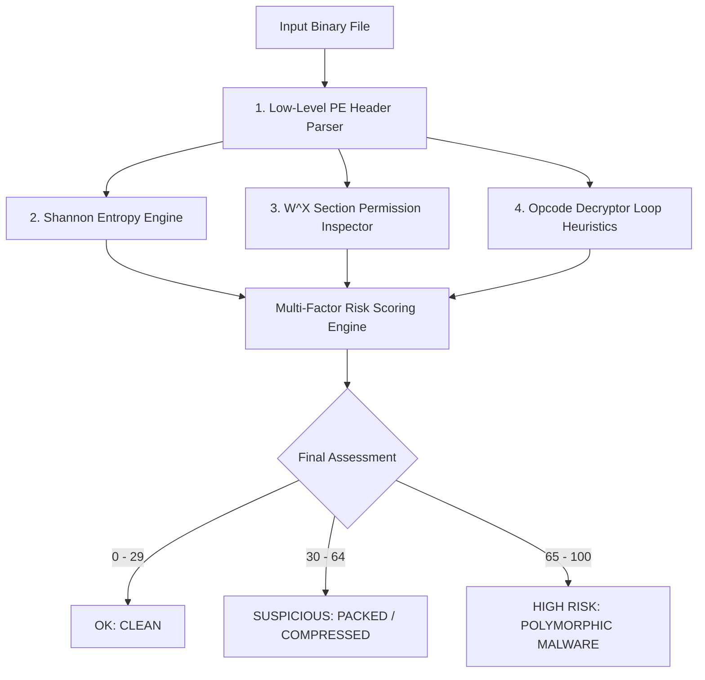

# Polymorphic Virus Detector & Behavioral Triage Engine

[](https://www.python.org/)
[](LICENSE)
[]()
[]()

A lightweight, high-speed, zero-dependency polymorphic malware detection engine built for hackathons and security triage. It detects encrypted and mutated malware **without requiring prior signatures, hash lists, or API keys** by analyzing fundamental mathematical and structural invariants.

---

## The Problem It Solves

Traditional antivirus relies on static file hashes (MD5, SHA-256) or known byte signatures. **Polymorphic malware** evades static signatures by:
1. Encrypting its core payload with a randomized key on every infection.
2. Generating a mutating **decryptor stub** using register swapping, instruction substitution, and junk-code insertion (NOPs).

Because every generated file has a unique hash, traditional signature databases have a **0% detection rate** against zero-day polymorphic strains.

This tool detects polymorphic malware by targeting the **three things it cannot hide**:
- **High Shannon Entropy**: Encrypted ciphertext appears as statistical randomness ($H \ge 7.0 / 8.0$).
- **$W \oplus X$ (Write XOR Execute) Violations**: Self-modifying code requires memory pages that are both writable and executable.
- **Entry-Point Decryptor Loop Heuristics**: Opcode analysis detects backward branches enclosing iterative arithmetic/XOR operations.

---

## Key Features

- **Zero External Dependencies**: Built entirely using Python standard libraries (`struct`, `math`, `os`, `sys`). Runs instantly on any system with Python 3.10+ installed.
- **Pure-Python PE Parser**: Low-level parsing of Windows Portable Executable headers (DOS stub, PE offset `0x3C`, COFF, Optional Header, Section Tables, Entry Points).
- **256-Byte Sliding-Window Entropy Engine**: Defeats **entropy dilution / zero-padding attacks** by detecting local pockets of high entropy even if overall file entropy is lowered.
- **$W \oplus X$ Permission Inspector**: Identifies dangerous memory sections with both `IMAGE_SCN_MEM_WRITE` (`0x80000000`) and `IMAGE_SCN_MEM_EXECUTE` (`0x20000000`).
- **Opcode Heuristic Engine**: Disassembles entry-point opcodes to flag backward loops (`LOOP 0xE2`, `JNZ 0x75`, `JMP 0xEB`) performing math modifications on memory.
- **Explainable Multi-Factor Scoring (0–100)**: Combines all signals into a transparent, weighted risk score with clear verdicts (`CLEAN`, `SUSPICIOUS`, `HIGH RISK`).
- **Built-in Safe Test Harness (`--demo`)**: Generates safe clean and simulated polymorphic samples on-the-fly for immediate testing and presentation demos.

---

## Quickstart & Installation

### Requirements
- Python 3.10 or higher.
- No third-party packages required (`pip install` is not needed).

### Clone the Repository
```bash
git clone https://github.com/Varun-R-2806/TCS.git
cd TCS
```

---

## Usage

### 1. Run the Built-In Demo (Automated Test)
```bash
python poly_detector.py --demo
```
This automatically generates:
1. `sample_clean.bin` — Predictable clean text/code $\to$ **Score: 0 / 100 [CLEAN]**
2. `sample_polymorphic.bin` — Simulated polymorphic payload $\to$ **Score: 70 / 100 [HIGH RISK]**
3. `sample_diluted.bin` — Zero-padded payload to test the 256-byte sliding window.

### 2. Scan Any Windows Executable
Test legitimate system software to verify zero false positives:
```bash
python poly_detector.py C:\Windows\System32\cmd.exe
```

### 3. Scan Any Target File
```bash
python poly_detector.py path/to/target_file.exe
```

---

## Example Scan Output

```text
============================================================
[*] Scanning: sample_polymorphic.bin
[*] Path:     C:\dev\TCS\sample_polymorphic.bin
============================================================

[1] ENTROPY ANALYSIS
    - Overall File Entropy:         7.56 / 8.0
    - Peak 256-Byte Window Entropy: 7.20 / 8.0 (Offset: 0x0100)
    - Format: Raw Binary / Non-PE Data
    - WARNING: File contains high-entropy payload (likely encrypted).

[2] DECRYPTOR STUB ANALYSIS
    - Analysis: Detected backward loop containing XOR/arithmetic operations (Classic Decryptor Stub)

[3] FINAL VERDICT & RISK ASSESSMENT
    - Suspicion Score: 70 / 100
    - VERDICT: [!] HIGH RISK - LIKELY POLYMORPHIC MALWARE
    - Key Indicators:
      * High entropy detected (suggests encrypted/compressed payload)
      * Decryptor stub detected (tight backward loop with XOR/crypto math)
============================================================
```

---

## Detection Architecture



---

## Repository Documentation

For in-depth theoretical analysis, mathematical proofs, and future roadmap specifications:
- [HACKATHON_POLYMORPHIC_DETECTOR_PLAN.md](HACKATHON_POLYMORPHIC_DETECTOR_PLAN.md) — Comprehensive technical blueprint, mathematical formulas, and judge defense guide.
- [PROJECT_CAPABILITIES_AND_ROADMAP.md](PROJECT_CAPABILITIES_AND_ROADMAP.md) — Implemented capabilities vs. detailed future roadmap (Unicorn CPU Emulation, in-memory YARA scanning, and CFG analysis).

---

## License

This project is licensed under the MIT License - see the LICENSE file for details.
